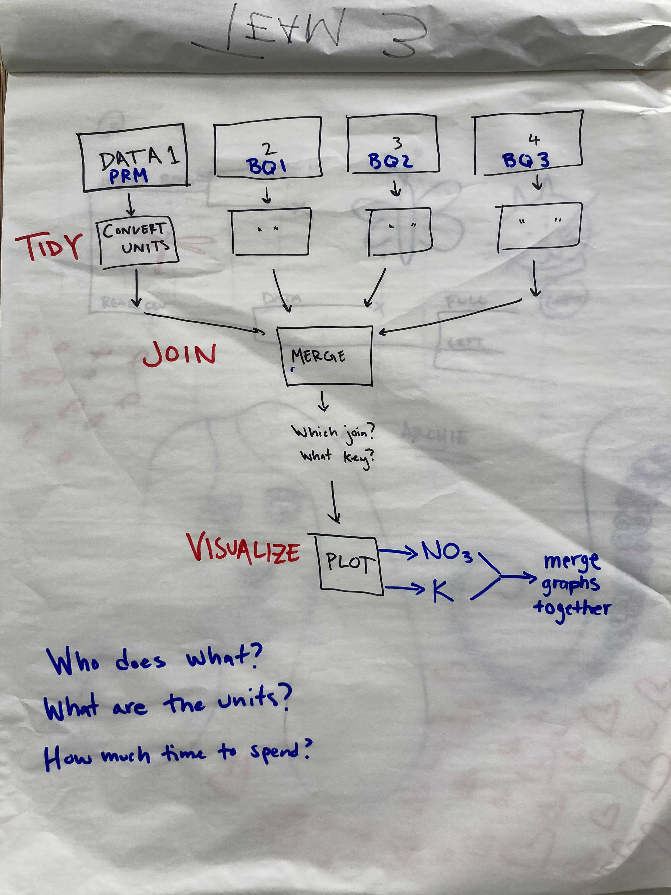
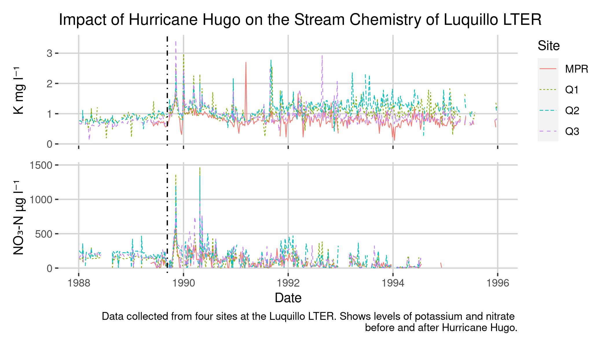

class: center, middle

# Team Bassest Hound


### Shout out to Archie and MaGoo
---
.center[
## Our Workflow Plan
```{r echo = FALSE, out.width= '50%'}

```
]

---

## Github Token Issues

#### - Server cache time-outs

#### - Tried regenerating tokens
.center[
```{r echo = FALSE, out.width = '35%'}
knitr::include_graphics('https://c.tenor.com/-bmg7ZdDvpYAAAAd/adorable-basset-hound-makes-silly-faces-smile.gif')
```
]
---
## Some Other Issues
#### - Pull/Push Issues

#### - Branches?

.center[
```{r echo = FALSE, out.width = '60%'}
knitr::include_graphics('https://c.tenor.com/c_P0z92D7coAAAAC/aristocats-dog.gif')
```
]
---

## Pair programming

#### - Best method for this project.

#### - Encouraged collaboration!

.center[
```{r echo = FALSE, out.width = '45%'}
knitr::include_graphics('https://c.tenor.com/lCBo1z7Den0AAAAd/sleeping-dog-viralhog.gif')
```
]

---

## Prepping the data
#### - Importing

  ```{r, eval = FALSE}
  prm_data <- read_csv("/courses/EDS214/team_basset_hound/data/
              RioMameyesPuenteRoto.csv", na = "-9999")
  ```
  
#### - Cleaning

  ```{r, eval = FALSE}
  prm_subset <- prm_data %>%
    clean_names() %>% 
    select(sample_date, sample_id, no3, k) %>% 
    mutate(sample_date = lubridate::mdy(sample_date))
  ```

#### - Merging

  ```{r, eval = FALSE}
  full_df <- full_join(prm_subset, bq1_subset) %>% 
    full_join(bq2_subset) %>% 
    full_join(bq3_subset) %>% 
    filter(year(sample_date) >= 1988 & year(sample_date) <= 1995)
  ```

---

## Creating the plot

```{r, eval = FALSE}
plot_k <- ggplot(data = full_df, aes(x = sample_date, y = k)) +

  geom_line(aes(color = sample_id, linetype = sample_id), size = 0.3) + 
  geom_vline(xintercept = as.POSIXct(as.Date("1989-09-10")), linetype = 4) + 
  theme(axis.text.x = element_blank(),
        axis.title.x = element_blank(),
        panel.background = element_blank(), 
        panel.grid.major = element_line(color = "light grey")) +
  labs(y = "K mg l\u207b\u00b9", 
       color = "Site",
       linetype = "Site",
       title = "Impact of Hurricane Hugo on the Stream Chemistry of Luquillo LTER")


plot_no3 <- ggplot(data = full_df, aes(x = sample_date, y = no3)) +
  geom_line(aes(color = sample_id, linetype = sample_id), show.legend = FALSE, size = 0.3) + 
  geom_vline(xintercept = as.POSIXct(as.Date("1989-09-10")), linetype = 4) +
  labs(x = "Date", 
       y = "NO\u2083\u2010N \u00b5g l\u207b\u00b9",
       caption = "Data collected from four sites at the Luquillo LTER. Shows levels of potassium and nitrate \nbefore and after Hurricane Hugo.") + 
  theme(panel.background = element_blank(), 
        panel.grid.major = element_line(color = "light grey")) 
  

final_plot <- (plot_k / plot_no3) 
```        


---

## Our Graph

```{r, echo = FALSE}


```

---

## Making the presentation

#### - We tried using Xarnigan!

#### - Had some issues


